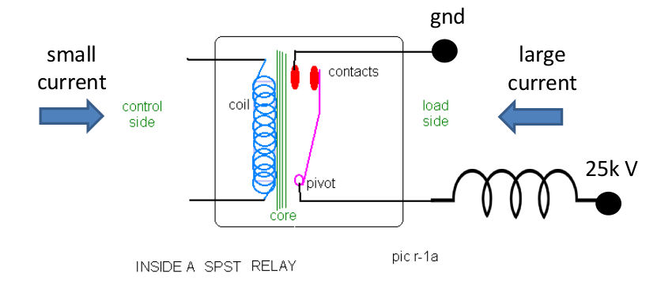
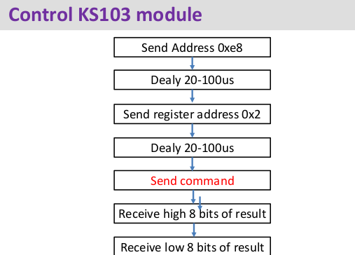
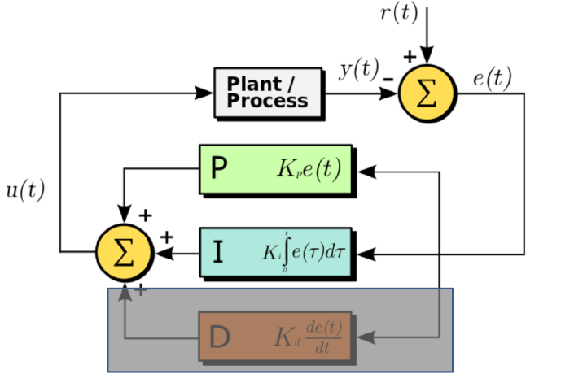

## 摘要
本文主要记录初级实训学习的主要内容。包括了大概是三个阶段：准备阶段：学习测量仪器，回顾C语言编程；熟悉阶段：在FPGA上运行HelloWorld，开发小应用，如跑马灯等，最后还了解了uc/os这样一个实时操作系统；以及最后的开发阶段，使用PWM波以及H桥控制车轮，使用超声模块控制让小车感知外界状况，从而进行控制，最后可以使用PID控制理论优化小车的控制。
<!--more-->

## 学习仪器
- 学会使用示波器，可以用来观察从ADC，PWM波等等信号。
- 学会使用万用表测电压，电阻，电流。

## 回顾c语言编程
- 条件判断
- 循环：for loop & while loop
- 数组：
  + 使用下标访问
  + 使用指针访问
- 函数使用：
  + 递归
  + 迭代
- 链表：
  + 结构体声明和使用
  + 指针使用
  + 链表结构和基本操作
- **位操作**
  + 位操作将十进制表示成二进制数
  + 位操作实现某一位的反转，或者某一位不变其它位反转等

## C语言进阶
- 使用header file，source file以及mainfile。尝试尽可能的复用。
- C语言与安全性
  + 数组越界
  + 判断逻辑不全
  + 变量没有初始化
  + 内存泄露
  + 没有考虑非法输入

## FPGA编程
- 使用自带软件测试FPGA完好
- 在FPGA上运行HelloWorld工程
- 实现LED Sliding Pattern
- **使用中断**
  + 中断的原理和运行机制

## FPGA上编程进阶
  - 在IDE：eclipse上进行Debug
  - ADC:
    + FPDA上有一个ADC的硬件模块

## PWM(Pulse Width Modulation)
  - Duty cycle
  - Why PWM? 
    + Digital voltage control: 只能控制1和0
    + 需要最大电压的x%则让占空比为x%
  - 产生PWM的方法：
    + 软件方法
      * 使用计数器
      * 使用中断？
    + 硬件方法
      * Hardware PWM IP <-- NIOS core
      * moto_setting(),能产生2个PWM波

## H桥
  - 低电流做控制，控制大电压去驱动电机
  - H桥以及PWM波驱动电机，是小车前进，后退，转弯等

## 超声模块
  - 超声模块是：KS103
  - 使用流程：
  
  - 接线
    + 使用Uart模式：
      * 超声TX接入FPGA的RX，超声的RX接入FPGA的TX
    + 使用I2C模式：
      * data pin & clock pin
  - **端口查找**
    + 结合QSF文件以及FPGA用户手册

## uc/OS
  - 以上都是bare metal hardware上编程，然后编译我们需要的程序
  - 如果需要完成复杂的多任务，可以考虑跑在一个操作系统上
  - 多任务（线程）
  - 信号量
  - 临界区访问

## PID控制
  - p：比例系数，I：积分系数，D：微分系数
  - 使用PI控制，因为高阶噪声，所以不使用D
  - 其中e（t）= r（t）-y（t）
  
