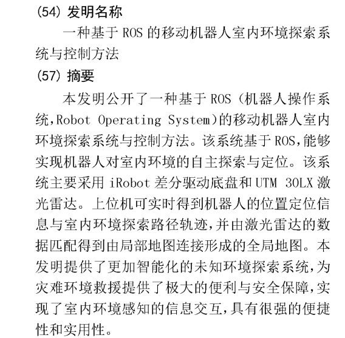
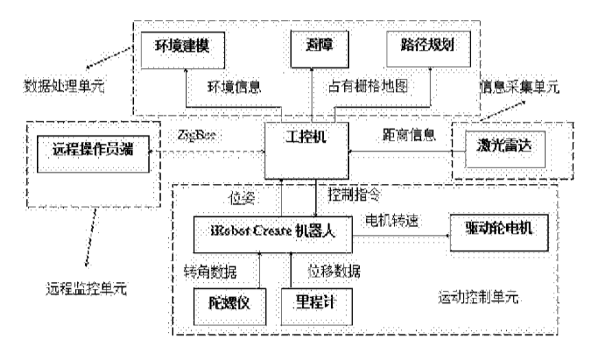
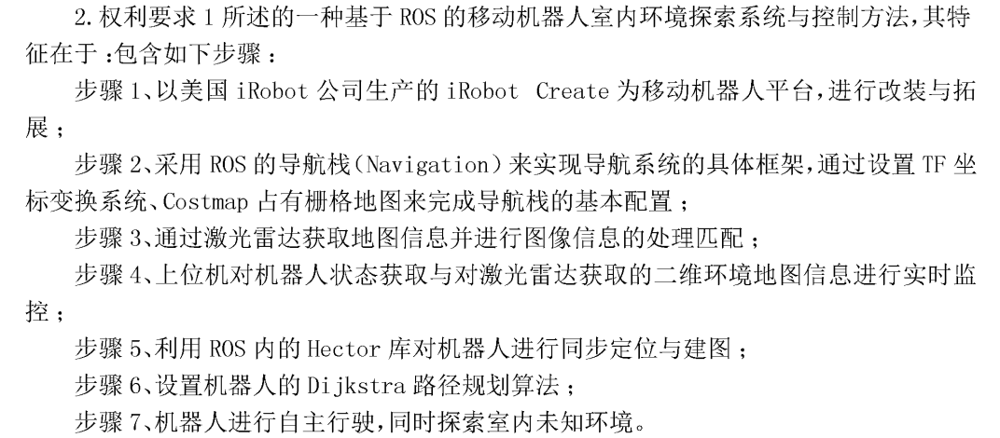
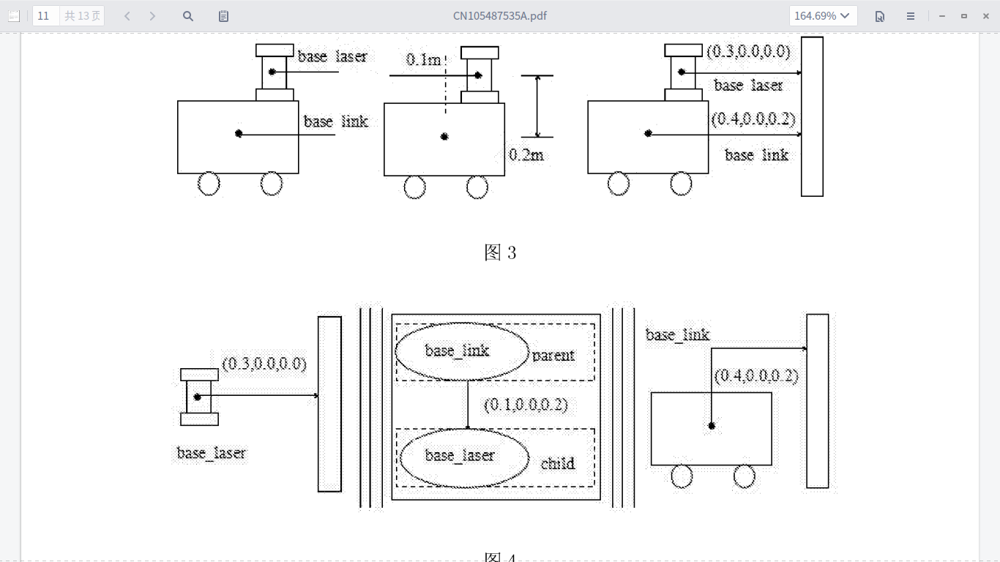
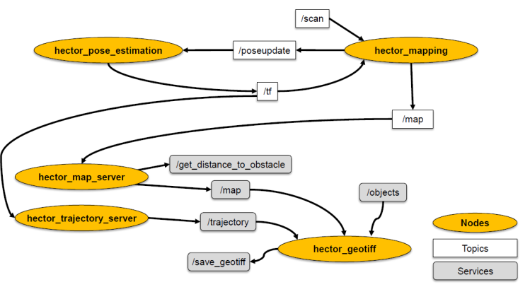
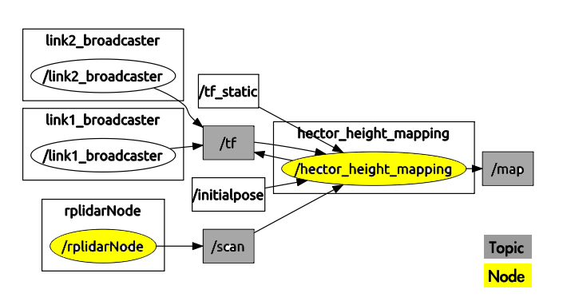
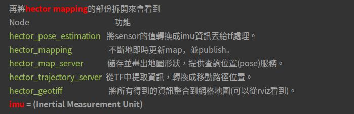
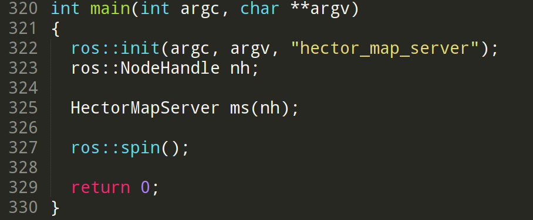

## 摘要
本文记录读源码前查看的一些资料，以及读源码遇到的疑惑的解答。
<!--more-->

（1）引用专利申请书：CN 105487535 A

ZigBee的特点：
低功耗、低成本、低速率、近距离、短延时、高容量、高安全

(2) 引用[博客](https://hollyqood.wordpress.com/2015/12/01/ros-slam-2-hector-slam-2d%E5%9C%B0%E5%9C%96%E5%BB%BA%E7%BD%AE/)

(3) 回调函数
在看源码的时候，看到大量的class中实现的方法有好大一部分是属于回调函数，所以补充学习了一下。回调函数的机制主要继承于C语言。基本道理很简单，一般来说，我们在一个系统上写的都是application，可以使用系统给我们提供的API；然而，在实现应用的时候，我们实现了一个函数被系统调用，或者说系统在提供一个API给我们的同时要求我们传入一个函数，这样的函数就叫做回调函数。
为什么需要使用回调函数呢？使用回调函数可以提供极大的灵活性以及适应性。比如说，系统提供了某一个功能的接口，但是这个功能的实现需要对数据进行排序，所以需要调用一个排序函数，但是系统不提供这个排序函数，而是要求应用者传入一个排序函数。这时候，使用者就可以根据具体的运算量，硬件的计算能力，延时要求等等条件，选择实现一个能够较好的满足各个需求的算法。如果系统本身直接某个某个排序算法，则可能无法兼顾实际上使用时候的一些要求。

(4) ROS::spin()
在看源码的时候，几乎main函数中必有这个spin（）。于是查看了相关的内容。其实这个函数是ROS消息回调函数。还有ROS：：spinOnce（）。两者区别在于前者调用后不会再返回，而后者在调用后还可以继续执行之后的程序。因此，在初始化时已经设置好所有消息的回调，并且不需要其他背景程序运行的情况下就使用ROS：：spin（）；仅仅使用回调不足以完成任务，还需要其他辅助程序的执行：比如定时任务、数据处理、用户界面等，就使用ROS：：spinOnce（）。

总体来说其原理是这样的：除了用户的主程序以外，ROS的socket连接控制进程会在后台接收订阅的消息，所有接收到的消息并不是立即处理，而是等到spin()或者spinOnce()执行时才集中处理。所以为了保证消息可以正常接收，需要尤其注意spinOnce()函数的使用 (对于spin()来说则不涉及太多的人为因素)。

必须关注到的是，使用了ROS：：spin（）之后，每次消息到达时会执行用户的回调函数进行操作，相当于程序是消息事件驱动的。这才解开了一个困惑我的问题：可以看到源码的main函数是这样的：

这样的main函数，新建了一个类的对象，但是并没有调用到任何的成员函数啊，这样的main函数有什么意义？噢，原来ROS：：spin（）使得这个函数变为了消息事件驱动的，意思就是，有消息过来，就调用这个对象中相应的回调函数。

更具体的内容可查[ROS官网](http://wiki.ros.org/roscpp/Overview/Callbacks%20and%20Spinning)或者是[ROS的消息回调处理：ros::spin()与ros::spinOnce()](http://www.yfworld.com/?p=2318)

