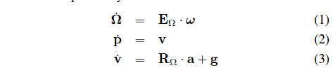

# Hector SLAM的效果
<iframe height=498 width=510 src="http://player.youku.com/embed/XMTU3ODMxNTgxNg==" frameborder=0 allowfullscreen></iframe>

# A Flexible and Scalabel SLAM system with Full 3D Motion Estimation
<!--more-->

## 一些关键词
- LIDAR: Light Detecting and Ranging 激光雷达

## 框架

Our approach combines a 2D SLAM system based on the integration of laser scans (LIDAR) in a planar map and an integrated 3D navigation system based on an inertial mea-surement unit (IMU), which incorporates the 2D informationfrom the SLAM subsystem as one possible source of aidinginformation.

## navigation frame
Full 3D state represent by

where:

The motion arbitrary rigid body is described by the nonlinear differential equation system:

## 2D SLAM
我们可以从LiDAR获取现实的连续信号，对此可以采用不同的采样率进行采样，当然不同的采样率最后得到的图形的精度会有所不同。对于采到的离散数据点阵，我们更为关注末端点。然后进行扫描匹配，得到位移和偏转的增量。最终得到建图和定位。
### Map Access
离散的栅格图的性质非常影响精度，没办法直接进行内插值以及微分的计算，要进行双线性内插值。
对于具体的处理方法参考John的博客：[双线性插值](http://m.blog.csdn.net/article/details?id=51512090)

### Scan Matching
扫描匹配是进行在aligning laser之间或者是与已存在的图片之间的。这里的方法是从图中成束的末端点里找到的最优解。由于是将扫描结果与已经存在的地图进行对齐，也就是意味着我们隐式地与此前所有的扫描结果做对比。
具体的来说，就是我们希望找到一个转化量

使得代价函数

得到最小值

我们又知道，机器人的在全局坐标下的姿态表示为：

得到误差测量表示，

### Multi-Resolution Map Representation

> 文中内容参考自[A Flexible and Scalabel SLAM System with Full 3D Motion Estimation](http://www.sim.tu-darmstadt.de/publ/download/2011_SSRR_KohlbrecherMeyerStrykKlingauf_Flexible_SLAM_System.pdf)

