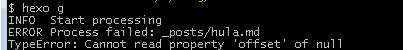
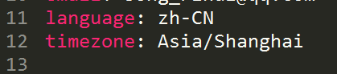
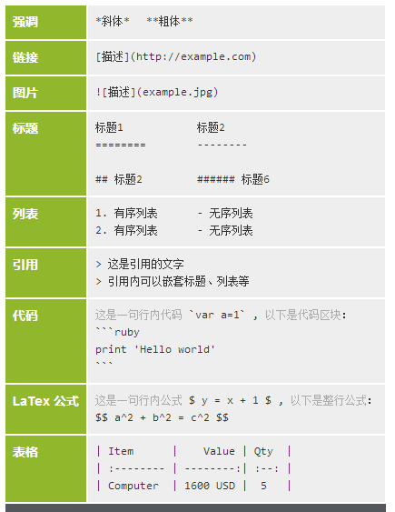

## 自言自语
回头一看，安装使用Hexo的过程并不是艰难的，然后，依然需要查看许多的不同的博客去解决问题，因为每个人需要解决的问题都是不一样的。
<!--more-->

## 具体的安装
安装步骤，需要git，Node.js，具体的安装教程太多，包括官网，许多博客，这里就略去了。

## 为github添加ssh key：
- 在本机运行
``` bash
ssh-keygen -t rsa -C "your_email@example.com"
```
- 接下来连续三次enter，这样push到github上就不需要输入密码
- 密码生成之后会保存在相应的.pub文件中。
- 复制粘贴key的内容到github->setting>ssh key

## 本地git配置
git config --global user.email "email@mail.com"
git config --global user.name "your name"

## 基本语句
我留下最基本的操作以及语法，简单，但是如果开始使用之后，确是最需要的。  
- Hexo clean：清楚public文件夹中内容
- Hexo g ：自动生成
- Hexo server (-p 4001): 如果没有括号中的内容，默认端口是4000，加上括号中的内容可以修改展示的端口。说到访问，打开浏览器，访问：http://localhost:4000 如果不成功，原因可能是没有安装server，使用npm安装。如果是之前使用过npm install，我建议可以先尝试更换端口。如果还不行，则可以尝试重新使用npm安装server：  
``` bash 
npm install hexo-server --save

```
- Hexo d ：同步到GitHub上
- Hexo n [post] “New Post”：建立新的文章 [样式]

## 编辑category以及tag，同时展示多篇文章
如果想要这样的效果，首先，需要选择一个喜欢的，并且支持category的theme，并follow安装步骤安装。一般都没有问题。如果不成功，查看hexo g 之后是否有这样的报错：



如果有，估计是时间的错误，也就是主目录但后者能够的_config.yml中的timezone



## 最后，附上Markdown的一些简单的语法

- 颜色
```html
<font color=red>红色</font>
```

- 其他

